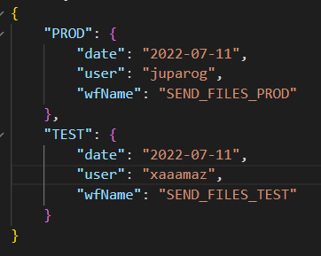
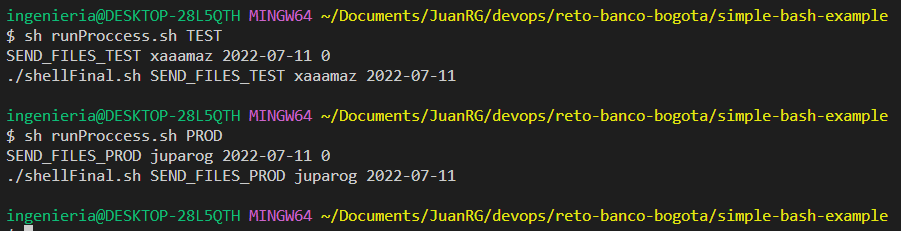

# Simple bash example
Automatizar la ejecución de un flujo de trabajo por medio de bash

# Descripción
Se ejecuta una shell la cual recibe un parametro, filtra en un archivo de referencia en formato json y extrae los datos finles del flujo a ejecutar. La ejecucion del flujo final se simulo con: __echo './shellFinal.sh '$wf_name' '$user' '$date_exec''__

# Ejcución y prueba
Ejecutar el comando
```
sh runProccess.sh TEST
```

Puede varial tst por cualquier otro parametro que tenga un valor definido en el archivo __./list_workflows.json__


Salida:
